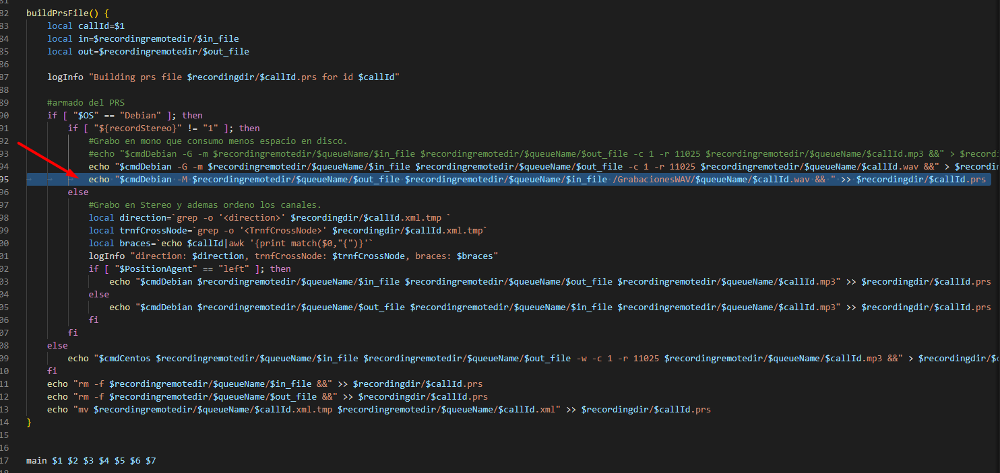

# SETUP PROCESO WAV TO FTP CUSTOM

Generalmente se monta el procedimiento sobre PBX que tengan el mixeo en mp3, se requiere configurar el mixeo en wav (separado del mixeo nativo) para subirlo a un repositorio FTP que sera usado posteriormente por SpeechAnalytics o QA.

Se recomienda que el FTP tenga un espacio de 3 TB aproximadamente (dependiendo de la cantidad de llamadas que tenga el cliente, adicional se debe considerar una depuración en el FTP a modo de que no se llene el FTP).

## CONFIGURACIÓN

### 0. Setup previo

Copiar los archivos del repositorio en alguna carpeta de la PBX, a fines de la guia se llamara "inicioGrab", ubicado en /home/brt001spt

### 1. Crear los directorios que se usaran en el proceso
 
```
mkdir /GrabacionesWAV
mkdir /GrabacionesWAV/q1
mkdir /GrabacionesWAV/q2
mkdir /GrabacionesWAV/q3
mkdir /GrabacionesWAV/q4
mkdir /GrabacionesWAV/q5
mkdir /GrabacionesWAV/qp

mkdir /GrabacionesWAVFailed
mkdir /GrabacionesWAVFailed/q1
mkdir /GrabacionesWAVFailed/q2
mkdir /GrabacionesWAVFailed/q3
mkdir /GrabacionesWAVFailed/q4
mkdir /GrabacionesWAVFailed/q5
mkdir /GrabacionesWAVFailed/qp
```

### 2. Copiar los scripts a la ruta /usr/sbin

```
cp /home/brt001spt/inicioGrab/UploadFilesToFTP.sh /usr/sbin/
cp /home/brt001spt/inicioGrab/UploadFailedToFTP.sh /usr/sbin/
```

### 3. Asegurar el formato unix y dar permisos a los archivos copiados

```
dos2unix /usr/sbin/UploadFilesToFTP.sh
dos2unix /usr/sbin/UploadFailedToFTP.sh
chown -R root:root /usr/sbin/UploadFilesToFTP.sh
chmod +x /usr/sbin/UploadFilesToFTP.sh
chown -R root:root /usr/sbin/UploadFailedToFTP.sh
chmod +x /usr/sbin/UploadFailedToFTP.sh
```

### 4. Programar crontab

```
nano /etc/crontab
```

```
# WAV Files to MW
* * * * * root /usr/sbin/UploadFilesToFTP.sh 1;
* * * * * root /usr/sbin/UploadFilesToFTP.sh 2;
* * * * * root /usr/sbin/UploadFilesToFTP.sh 3;
* * * * * root /usr/sbin/UploadFilesToFTP.sh 4;
* * * * * root /usr/sbin/UploadFilesToFTP.sh 5;

* * * * * root /usr/sbin/UploadFailedToFTP.sh 1;
* * * * * root /usr/sbin/UploadFailedToFTP.sh 2;
* * * * * root /usr/sbin/UploadFailedToFTP.sh 3;
* * * * * root /usr/sbin/UploadFailedToFTP.sh 4;
* * * * * root /usr/sbin/UploadFailedToFTP.sh 5;
```

### 5. Editar el archivo /usr/sbin/UploadFilesToFTP.sh y /usr/sbin/UploadFailedToFTP.sh

Se debe editar con los datos correspondientes del servidor FTP y en el servidor FTP se debe configurar la carpeta speechanalytics, donde se dejaran los audios:

1. Crear carpeta "speechanalytics"
2. Editar los siguientes campos acorte a los datos del FTP:

    ```
    ftpuser="administrator"
    ftppassword="PassWordFTP123"
    recordingremotehost="10.150.71.3"
    remotedirPath="/Speech\ Analytics"
    ```

El campo remotedir se debe configurar en caso este espeficado donde debe almacenarse, en el caso de Skytel si aplica dejarlo con "Speech Analytics", el caracter "\\" es usado para que se considere el espacio en el nombre de la carpeta, no debe modificarse en este caso. Si en otro ambiente va directamente en la raiz se puede dejar en blanco remotedir=""

### 6. Editar el archivo /usr/sbin/tkpostrecording.sh

Se recomienda en primer paso hacer un backup:

```
mkdir /home/brt001spt/backupscambiowav/
cp -p /usr/sbin/tkpostrecording.sh /home/brt001spt/backupscambiowav/tkpostrecording.sh
```

Añadir la siguiente linea en el archivo tkpostrecording en la funcion buildPrsFile(), se usa el flag -M para indicar que es un mixeo de ambas partes y se usa la configuracion de positionAgent "Right" segun lo sugerido por la guia "Cómo setear el formato de grabación de audios a .wav" [https://inconcert.atlassian.net/wiki/spaces/i6Docs/pages/1126301763/C+mo+setear+el+formato+de+grabaci+n+de+audios+a+.wav]:

```
echo "$cmdDebian -M $recordingremotedir/$queueName/$out_file $recordingremotedir/$queueName/$in_file /GrabacionesWAV/$queueName/$callId.wav && " >> $recordingdir/$callId.prs
```

Tambien pueden visualizarlo en la imagen:


